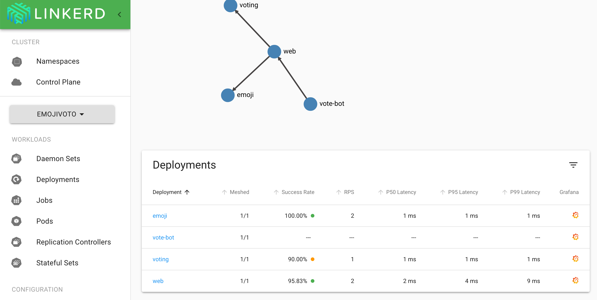
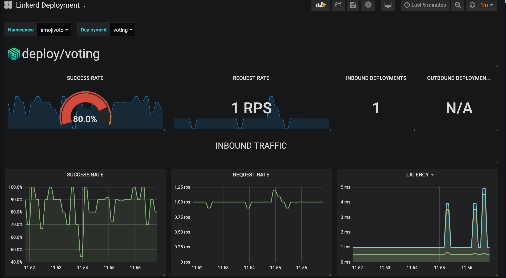

# Installing the Linkerd Service Mesh on Civo Managed Kubernetes

## Introduction

The Civo managed Kubernetes platform allows you to implement the components you like to use on your cluster, including service meshes and other service components. While the [Civo Kubernetes marketplace](https://www.civo.com/learn/deploying-applications-through-the-civo-kubernetes-marketplace) offers a one-click install of the `Maesh` service mesh, you may want to install a different solution of your choice that is not offered on the marketplace. Whether it is for feature experimentation or preference one type of tool over another, it is a good idea to consider meshing the services on your Kubernetes cluster. With a service mesh, you will be able to get native observability of inter-service communication provided by the visualisation and analysis tools they bundle.

This guide will cover the installation of Linkerd, a Service Mesh, using the Civo command-line interface, as at the time of writing this was not available as a marketplace application. You can, of course, use another service mesh of your choice instead - popular choices for this are [Istio](https://istio.io/), [Consul](https://www.hashicorp.com/products/consul/service-mesh) and the Traefik-based [Maesh](https://mae.sh/). You can install Maesh on your cluster with one click straight from the [Civo Kubernetes App Store](https://www.civo.com/learn/deploying-applications-through-the-civo-kubernetes-marketplace).

If you want to use any of the other available service meshes, see their respective official documentation for installation instructions, which you will be able to follow once you set up your cluster according to the instructions below.

## Pre-Requisites
You will need the following to get started:
- A Civo account and access to the managed Kubernetes beta. You can [apply for the beta here](https://www.civo.com/kube100) - mention this guide in your application!
- The [Civo Command-Line tool installed](https://www.civo.com/learn/kubernetes-cluster-administration-using-civo-cli) with your API key added.
- `kubectl` [downloaded and set up](https://kubernetes.io/docs/tasks/tools/install-kubectl/).
- Optional: `kubectx` [to handle context-switching](https://github.com/ahmetb/kubectx) if you are managing multiple clusters.

## What is a Service Mesh?
Typically, a Service Mesh uses processes known as sidecars deployed alongside and containerised separately from service processes. Effectively mini-proxies, these sidecars watch traffic to and from services on your nodes, and provide visibility and control. The notable exception to this is Maesh, mentioned above, which does not function via sidecars. The broad functionality remains the same, though.

## Setting Up Our Cluster

Let's get started by creating a cluster and saving its KUBECONFIG to our ~/.kube/config file using the Civo CLI:
```
$ civo k8s create --nodes=2 --size=g2.medium --wait --save --switch
Building new Kubernetes cluster extra-spiral: Done
Created Kubernetes cluster extra-spiral in 01 min 37 sec
Merged config into ~/.kube/config and switched context to extra-spiral
```
I already have a Kubernetes cluster on my account, so the tool has *merged* my configuration. Handily, using the combination of options `--wait --save --switch` will automatically change our cluster management context to the one that was just created. If you prefer to switch cluster contexts manually, use `kubectx <cluster-name>` after you have downloaded the KUBECONFIG.

Let's see what we have running on our cluster straight out of the box. We shouldn't have anything except for what `k3s` bundles automatically, including the `traefik` ingress controller. An ingress controller is required by Linkerd:
```
$ kubectl get pods --all-namespaces
NAMESPACE     NAME                         READY   STATUS      RESTARTS   AGE
kube-system   coredns-66f496764-flbsm      1/1     Running     0           6m
kube-system   helm-install-traefik-77dx7   0/1     Completed   0           6m
kube-system   svclb-traefik-l5bff          3/3     Running     0           5m
kube-system   svclb-traefik-dwnr8          3/3     Running     0           5m
kube-system   traefik-d869575c8-hrfcv      1/1     Running     0           5m
```

## Installing Linkerd
I will reproduce the steps I took to install Linkerd for this guide below, but you should always refer to the [official Linkerd documentation](https://linkerd.io/2/getting-started/) for the latest way to deploy it, as updates may introduce changes.

### Installing Linkerd CLI
We will need to obtain the Linkerd Command-line interface to then install the control plane onto our Kubernetes cluster. Run the following code in your terminal on your computer: `curl -sL https://run.linkerd.io/install | sh`

On my Mac, I saw the following:
```
$ curl -sL https://run.linkerd.io/install | sh
Downloading linkerd2-cli-stable-2.6.0-darwin...
  % Total    % Received % Xferd  Average Speed   Time    Time     Time  Current
                                 Dload  Upload   Total   Spent    Left  Speed
100   623    0   623    0     0   2298      0 --:--:-- --:--:-- --:--:--  2307
100 41.1M  100 41.1M    0     0  1041k      0  0:00:40  0:00:40 --:--:-- 1090k
Download complete!

Validating checksum...
Checksum valid.

Linkerd stable-2.6.0 was successfully installed 🎉


Add the linkerd CLI to your path with:

  export PATH=$PATH:/Users/kai/.linkerd2/bin

Now run:

  linkerd check --pre                     # validate that Linkerd can be installed
  linkerd install | kubectl apply -f -    # install the control plane into the 'linkerd' namespace
  linkerd check                           # validate everything worked!
  linkerd dashboard                       # launch the dashboard

Looking for more? Visit https://linkerd.io/2/next-steps
```
These are exactly the steps we are going to take, starting with adding Linkerd to our `PATH`. On a Mac/Linux the following command will work in any shell, in Windows you will have to be using the PowerShell:
```
$ export PATH=$PATH:$HOME/.linkerd2/bin
```
Note that if you want the PATH setting to persist between sessions, you will have to add it to your shell configuration file.

Let's validate our Linkerd installation:
```
$ linkerd check --pre
kubernetes-api
--------------
√ can initialize the client
√ can query the Kubernetes API

kubernetes-version
------------------
√ is running the minimum Kubernetes API version
√ is running the minimum kubectl version

pre-kubernetes-setup
--------------------
√ control plane namespace does not already exist
√ can create Namespaces
√ can create ClusterRoles
√ can create ClusterRoleBindings
√ can create CustomResourceDefinitions
√ can create PodSecurityPolicies
√ can create ServiceAccounts
√ can create Services
√ can create Deployments
√ can create CronJobs
√ can create ConfigMaps
√ no clock skew detected

pre-kubernetes-capability
-------------------------
√ has NET_ADMIN capability
√ has NET_RAW capability

pre-linkerd-global-resources
----------------------------
√ no ClusterRoles exist
√ no ClusterRoleBindings exist
√ no CustomResourceDefinitions exist
√ no MutatingWebhookConfigurations exist
√ no ValidatingWebhookConfigurations exist
√ no PodSecurityPolicies exist

linkerd-version
---------------
√ can determine the latest version
√ cli is up-to-date

Status check results are √
```
Nice, we're ready to roll.

### Installing Linkerd onto our cluster

By default, Linkerd is installed to a namespace called `linkerd`. We are not going to be changing this, so the basic installation command will be simple:
```
$ linkerd install | kubectl apply -f -
```
The above command generates the `yaml` manifests required by `linkerd` and the pipe assigns the resulting files to be applied onto your cluster by `kubectl`.

You should see a number of roles, role bindings and deployments being created in the output.

To verify our installation is complete and `linkerd` is running, let's check the pods again:
```
$ kubectl get pods --all-namespaces
NAMESPACE     NAME                                      READY   STATUS      RESTARTS   AGE
kube-system   coredns-66f496764-flbsm                   1/1     Running     0          48m
kube-system   helm-install-traefik-77dx7                0/1     Completed   0          48m
linkerd       linkerd-identity-859ffb78db-xknxl         2/2     Running     0          2m12s
linkerd       linkerd-destination-74b988cccc-9gddg      2/2     Running     0          2m12s
linkerd       linkerd-sp-validator-c8cf79984-2rsvq      2/2     Running     0          2m11s
linkerd       linkerd-tap-67f6f4d94f-8gqjj              2/2     Running     0          2m11s
linkerd       linkerd-proxy-injector-7687b99bd7-kxrx8   2/2     Running     0          2m11s
linkerd       linkerd-grafana-74cfb44b49-j8xbp          2/2     Running     0          2m11s
linkerd       linkerd-controller-58457d4fd6-pff2n       3/3     Running     0          2m12s
linkerd       linkerd-web-57d95dcbb-kb8db               2/2     Running     0          2m12s
linkerd       linkerd-prometheus-c6fd999fc-vl45z        2/2     Running     0          2m12s
```
That's them running alright!

### Basic Linkerd Usage
Linkerd provide a great tutorial on using the service mesh on their site with an example application called `emojivoto`. All their documentation references this app, so it's a handy reference guide. [Follow the steps here](https://linkerd.io/2/getting-started/#step-5-install-the-demo-app) to deploy it and watch Linkerd do its thing.

Once you have added Linkerd to the service(s) you want on your cluster, you will be able to look at request details and their success percentage, for example:
```
$ linkerd -n emojivoto stat deploy
NAME       MESHED   SUCCESS      RPS   LATENCY_P50   LATENCY_P95   LATENCY_P99   TCP_CONN
emoji         1/1   100.00%   1.1rps           1ms           1ms           1ms          2
vote-bot      1/1         -        -             -             -             -          -
voting        1/1   100.00%   0.5rps           1ms           1ms           1ms          2
web           1/1   100.00%   1.1rps           2ms           4ms           4ms          2
```

Another way to watch your cluster's requests at the individual pod or deployment level is to use the `linkerd tap` command such as `$ linkerd -n emojivoto tap deploy/web`. As the name "tap" suggests, though, this is going to show the flow of requests, so will quickly fill your screen!

Linkerd includes a dashboard that bundles `Grafana` to display data collected by `Prometheus` that will allow you to visualise traffic and identify issues on your cluster without having to deal with streams of console data. You can start it at any time from your terminal by running the following command, which will transparently open port-forwarding from your cluster and open your browser to the dashboard:
```
$ linkerd dashboard &
```


If you want to drill down to individual metrics, such as finding out why the success rate on "voting" is not completing 100% of the time, you can click through to "Grafana" and get more detail about each component:



## Conclusion
By following this guide, you will have successfully installed `Linkerd` as a Service Mesh for runtime debugging, observability and reliability. If you would want to use another Service Mesh, follow the official documentation for the Service Mesh you want after the "Setting up your cluster" section.

If you chose to follow the `emojivoto` guide for Linkerd usage, you will have learned about the basics of uncovering service issues and how to fix them.

Let us know on Twitter [@civocloud](https://twitter.com/civocloud) if you have a favourite service mesh solution - and why!